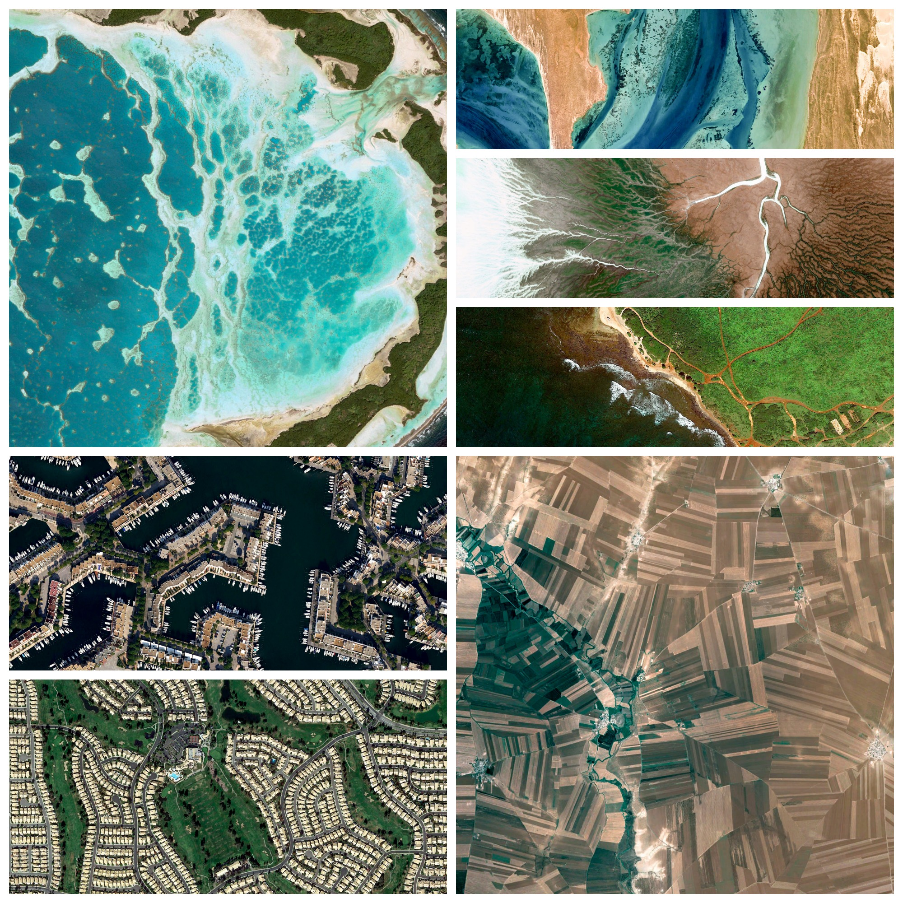

Pretty Earth
============



Scripts to download beautiful images from google earth

## Run

```bash
npm i && node ./index.js
```

## Pictures

The downloaded pictures are stored in the `pictures/` folder, there's roughly a thousand (`~640MB`), so downloading can take a few minutes (`12mn` on my `1MB/s` connection).

Most of the picture are beautiful, so sit back and enjoy :)
